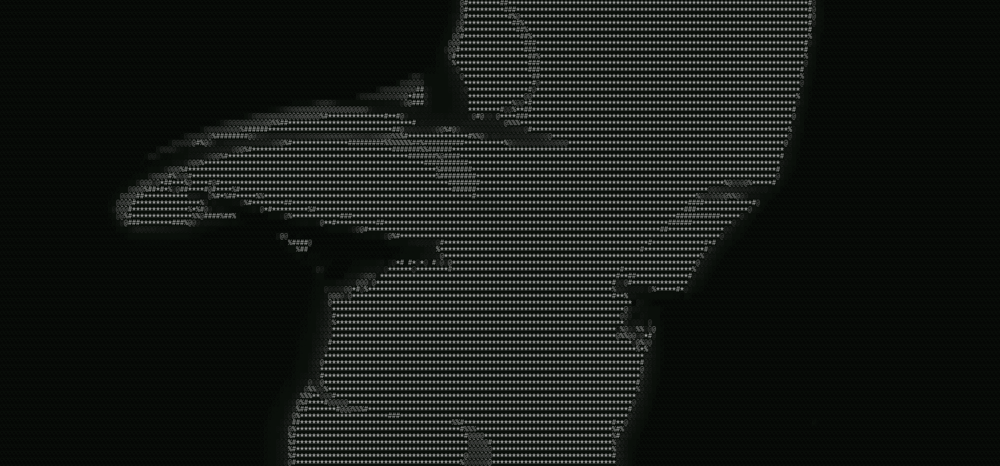

  

# gif-to-ascii

Two separate tools for converting GIFs to ASCII art:

- **Web converter** — converter built in typescript that runs locally on the browser, has higher customization with parameters (Lumonisity, Contrast, Intensity, Detail)

- **CLI** — Rust-based, work in progress ([jump to section](#cli-a-work-in-progress))

---

## Web Converter

> **Live:** [add-url]  
> **Demo:**

  
<video src="readme-assets/demo.mp4" controls width="100%">
</video>

### Parameters

Tinker around and find out the best settings for your gifs
| Parameter | Effect |
|-----------|--------|
| **Luminosity** | — |
| **Detail** | reduces font size and packs in more characters to fill space |
| **Contrast** | enhances or reduces color saturation |
| **Intensity** | increasing it adds more white information |

---

## CLI *(work in progress)*

Both tools are developed independently.

### Goals for cli

- `gif-to-ascii /path/to/gif` — outputs an ASCII gif in the working directory
